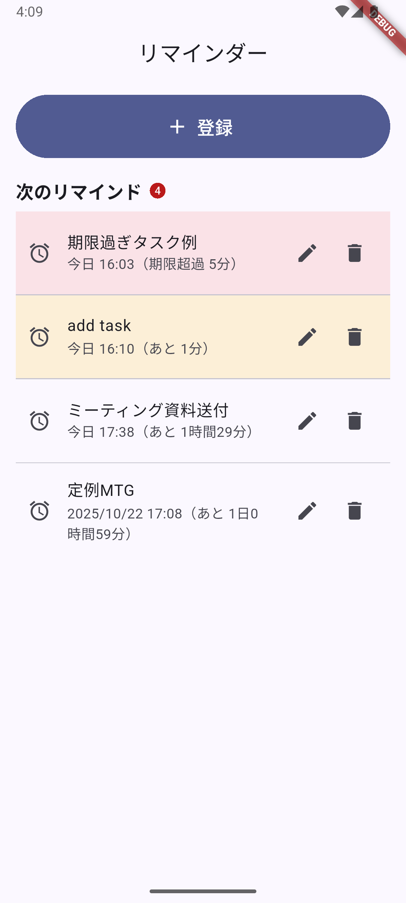

# new_reminder

A new Flutter project.

## Getting Started

This project is a starting point for a Flutter application.

A few resources to get you started if this is your first Flutter project:

- [Lab: Write your first Flutter app](https://docs.flutter.dev/get-started/codelab)
- [Cookbook: Useful Flutter samples](https://docs.flutter.dev/cookbook)

For help getting started with Flutter development, view the
[online documentation](https://docs.flutter.dev/), which offers tutorials,
samples, guidance on mobile development, and a full API reference.


## Debug Start
```
# 1. 端末一覧（エミュ or 実機）
flutter devices

# 2. 利用可能なemulator一覧
flutter emulators

# 3. エミュレータ起動（例：Pixel 3a）
flutter emulators <deviceName>

# 4. 実行（デバイスIDは flutter devices で確認）
flutter run -d <deviceId>

```


#### 代替手段
```
# Windows デスクトップでUI確認
flutter run -d windows
```

#### Tips
```
Hot Reload: コンソールで r

Hot Restart: R

終了: q
```


#### アプリケーションイメージ画像
